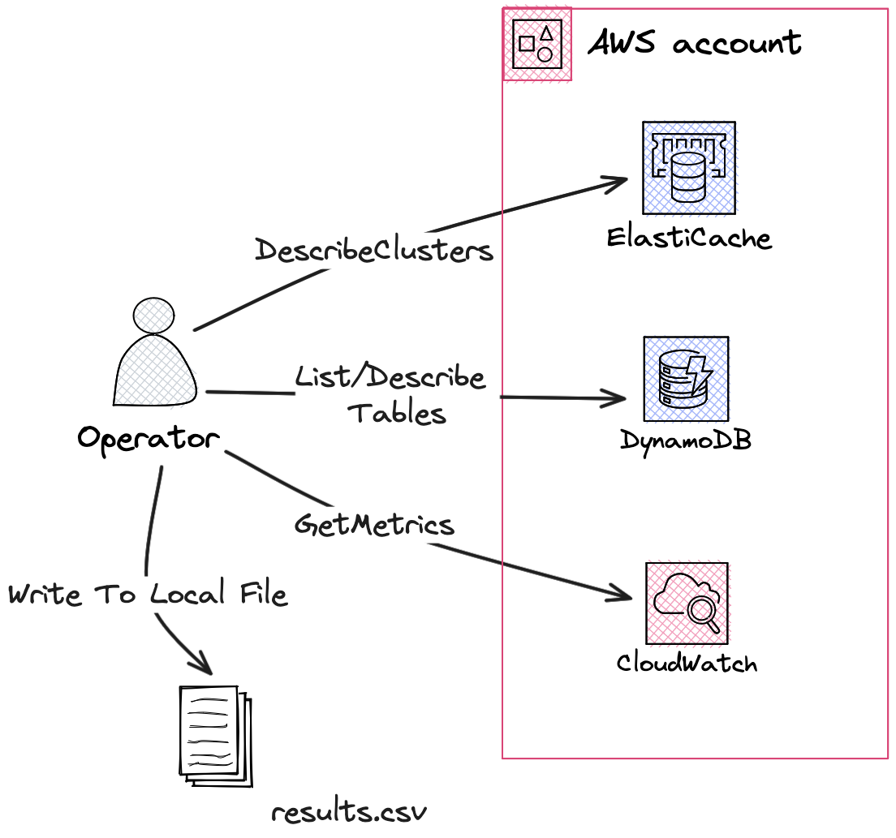

# aws-usage-analyzer

The aws-usage-analyzer script will fetch information about your Elasticache clusters and DynamoDB Tables to help find 
oppurtunities for optomizations with Momento.



## Permissions Needed

This script is currently intended to be run from an operator laptop with READ only permissions.
Specifically you will need following permissions from cloud watch, elasticache, and DynamoDB.

```
elasticache:DescribeCacheClusters
cloudwatch:GetMetricData
dynamodb:ListTables
dynamodb:DescribeTable
```

## Requirements.

- [Go](https://go.dev/dl/)

## Building:

Running the following build step will output a binary artifact to the `dist` folder.

```console
make build
```

## Running

After building the script you can run it with the following commands:

```console
chmod +x ./dist/aws-usage-analyzer
AWS_PROFILE=my-profile AWS_REGION=us-west-2 ./dist/aws-usage-analyzer
```

Running the script will produce an output file named `results.csv` with raw data about your workloads needed for
analysis.
